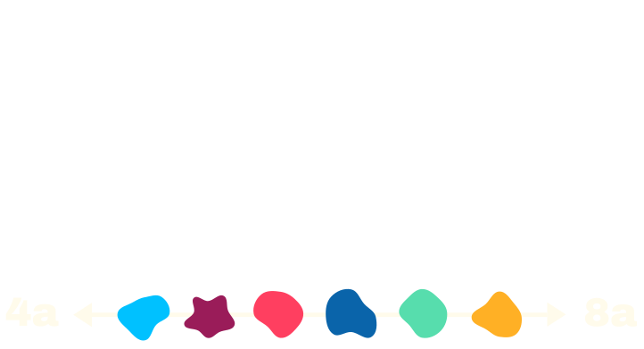

# 

[](https://reactjs.org/)
[](https://vitejs.dev/)
[](https://tailwindcss.com/)
[](https://firebase.google.com/)

A React + Vite app where users watch short bouldering videos and guess the climbing grade. The app uses **Firestore** for storing videos and aggregate guess statistics, **custom UI primitives** (Vaul/Radix), and helper functions for grade conversion and comparison.

It’s designed with **Progressive Web App (PWA)** principles in mind, with the intention to release it for **Android and iOS**, so users can install and play it directly on their devices.

## Live Demo

👉 **Try it here:**  
https://luukdg.github.io/guess-the-grade-react/


## Features

- Watch short bouldering videos and guess the grade.
- Store guesses and compute aggregate statistics using Firestore.
- Upload new videos (via YouTube links) with a validated upload form.
- Persist user settings to local storage.
- Reusable, accessible UI components built with Radix/Vaul.
- Tailwind CSS for styling and motion-based animations.

## Quick start

1. Install dependencies

```bash
npm install
```

2. Run development server

```bash
npm run dev
```

3. Build for production

```bash
npm run build
```

4. Run linting

```bash
npm run lint
```

## Scripts (common)

- dev: start Vite dev server
- build: produce production build
- preview: preview production build
- lint: run ESLint
- test: (if configured) run tests

See `package.json` for the exact scripts.

## Project structure (high level)

- src/
  - main.jsx — app entry
  - App.jsx — routing and top-level layout
  - pages/
    - game.jsx — game UI
    - upload.jsx — upload form and validation
    - settings.jsx — settings page
  - components/
    - main/
      - videoGuess.jsx — video player & guess UI
      - result.jsx — results screen
    - UI/ — reusable primitives (button, dialog, slider, drawer, etc.)
  - functions/
    - gradeConverter.jsx — grade conversion helpers
    - getGradeLabel.jsx — human-readable grade labels
    - settingsContext.jsx — settings provider & hooks
  - lib/
    - utils.js — `cn` and other small helpers
- firebase/
  - firebaseConfig.js — Firebase setup (keep secrets safe)
  - scripts for migration / seeding

## Firebase

- Firestore stores video documents and guess arrays/aggregates.
- Config is in `firebase/firebaseConfig.js`. Do not commit production secrets to public repos.
- Example helper scripts exist under `firebase/` for seeding or migrating data.

## Key flows

- Playing & guessing
  - `VideoGuess` handles playback and submitting a guess to Firestore.
  - Aggregation of guesses is read from the video document; user-specific data can be stored per-device (or via auth).
- Uploading videos
  - `upload.jsx` validates YouTube links and writes a new video document with initial metadata.
- Settings
  - `settingsContext.jsx` persists toggles (playback options, UI preferences) to local storage.

## UI & Styling

- UI primitives live in `src/components/UI/` and use `cn` for class merging.
- Animations and direction-aware styles use data attributes (configured on drawer, dialog, etc.).
- Tailwind CSS is used for utility-first styling.

## Troubleshooting

- Video playback issues: inspect `VideoGuess` controls and settings in `settingsContext.jsx`.
- Merge conflicts in UI files typically involve trailing semicolons and JSX formatting; run the formatter (Prettier) and ESLint autofix.
- Firestore permission errors: check rules in the Firebase console and your credentials.

## Contributing

- Follow lint rules and run tests locally.
- Open issues for bugs or feature requests.
- Submit PRs against the `main` branch with descriptive titles and a small scope.

## Future Plans

- Release **Guess The Grade** as a PWA for Android and iOS, allowing users to install it directly on their phones.
- Add authentication and social features for tracking scores and competing with friends.
